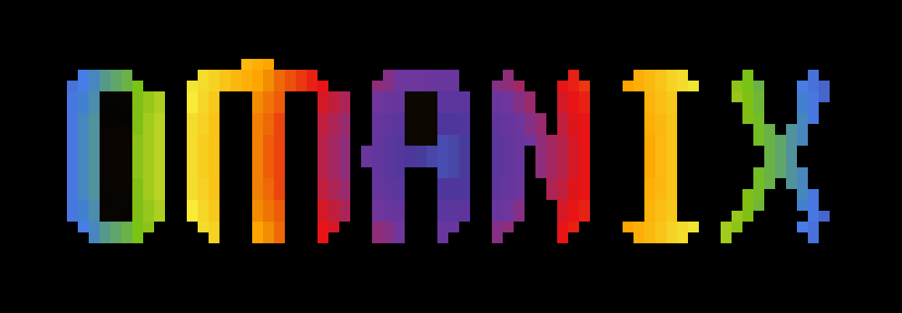

<p align="center">
  
</p>

<h3 align="center">A faithful NixOS port of <a href="https://github.com/basecamp/omarchy">Omarchy</a></h3>

---

## Philosophy

[Omarchy](https://omarchy.org) is DHH's beautiful, modern, and opinionated Hyprland desktop environment built for Arch Linux. Omanix brings that same experience to NixOS with one guiding principle: **stay as close to Omarchy as possible**.

This is a port, not a reimagining. When Omarchy evolves, Omanix follows.

- **Same look and feel** — identical themes, wallpapers, keybindings, and UI behavior
- **Same scripts** — utility scripts ported with the same names and logic, adapted only where Nix demands it
- **Same workflow** — if it works a certain way in Omarchy, it works the same way here
- **Nix where it matters** — declarative configuration, reproducible builds, and atomic rollbacks without changing the user experience

Deviations from Omarchy are made only when technically unavoidable and are always documented.

---

## Features

- 17 color themes with automatic light/dark mode switching
- Hyprland Wayland compositor with smart focus-or-launch behavior
- Ghostty, Alacritty, and Kitty terminal support (all fully themed)
- Walker app launcher, waybar status bar, mako notifications
- Neovim and VSCode integration
- Docker, lazygit, and modern dev tooling
- Webapp desktop integration — turn websites into apps
- Optional NVIDIA, gaming, FIDO2, and voxtype voice dictation support
- Battery monitoring, restart utilities, and system helpers

---

## Quick Start

### Prerequisites
1. A [NixOS](https://nixos.org/) installation
2. [Home Manager](https://github.com/nix-community/home-manager) configured

### Installation

Add this flake to your NixOS configuration:

```nix
{
  inputs = {
    nixpkgs.url = "github:nixos/nixpkgs/nixos-unstable";

    omarchy-nix = {
      url = "github:mrosseel/omarchy-nix";
      inputs.nixpkgs.follows = "nixpkgs";
      inputs.home-manager.follows = "home-manager";
    };

    home-manager = {
      url = "github:nix-community/home-manager";
      inputs.nixpkgs.follows = "nixpkgs";
    };
  };

  outputs = { nixpkgs, omarchy-nix, home-manager, ... }: {
    nixosConfigurations.your-hostname = nixpkgs.lib.nixosSystem {
      modules = [
        omarchy-nix.nixosModules.default
        home-manager.nixosModules.home-manager

        {
          omarchy = {
            username = "your-username";
            full_name = "Your Name";
            email_address = "your.email@example.com";
            theme = "tokyo-night";
          };

          home-manager.users.your-username = {
            imports = [ omarchy-nix.homeManagerModules.default ];
          };
        }
      ];
    };
  };
}
```

Then rebuild your system:
```bash
sudo nixos-rebuild switch --flake .
```

---

## Configuration Options

### Required Options

```nix
omarchy = {
  username = "your-username";
  full_name = "Your Name";
  email_address = "you@email.com";
  theme = "tokyo-night";
};
```

### Theme Options

**Available themes:**
- `tokyo-night` (default)
- `kanagawa`
- `everforest`
- `catppuccin`
- `catppuccin-latte` (light)
- `rose-pine`
- `rose-pine-dawn` (light)
- `rose-pine-moon`
- `nord`
- `gruvbox`
- `gruvbox-light` (light)
- `flexoki-light` (light)
- `matte-black`
- `ethereal`
- `hackerman`
- `osaka-jade`
- `ristretto`

**Light theme auto-detection:**
```nix
omarchy.light_theme_detection = {
  enable = true;  # default
  light_theme_mappings = {
    "tokyo-night" = "catppuccin-latte";
    "kanagawa" = "rose-pine-dawn";
    "everforest" = "gruvbox-light";
    "catppuccin" = "catppuccin-latte";
    "rose-pine" = "rose-pine-dawn";
    "rose-pine-moon" = "rose-pine-dawn";
    "nord" = "gruvbox-light";
    "gruvbox" = "gruvbox-light";
  };
};
```

Create `~/.config/omarchy/theme/light.mode` to switch to light mode.

### Display Configuration

```nix
omarchy = {
  monitors = [
    "eDP-1,preferred,auto,2"
    "HDMI-A-1,1920x1080,auto,1"
  ];
  scale = 2;
  primary_font = "Liberation Sans 11";
};
```

### Application Choices

```nix
omarchy = {
  browser = "chromium";  # or "brave"
  terminal = "ghostty";  # or "alacritty", "kitty"
};
```

### Optional Features

#### Gaming Support
```nix
omarchy.gaming.enable = true;
```

#### NVIDIA GPU Support
```nix
omarchy.nvidia.enable = true;
```

#### Seamless Boot
```nix
omarchy.seamless_boot = {
  enable = true;
  username = "your-username";
  plymouth_theme = "omarchy";
  silent_boot = true;
};
```

#### FIDO2 Authentication
```nix
omarchy.fido2_auth = {
  enable = true;
  sudo_auth = true;
  fingerprint_support = false;
};
```

#### Firewall
```nix
omarchy.firewall = {
  enable = true;  # default
  docker_protection = true;
  allow_ssh = false;
  allow_dev_ports = true;
  allowed_tcp_ports = [];
  allowed_udp_ports = [];
};
```

#### Voice Dictation
```nix
omarchy.voxtype.enable = true;
```
Hold `SUPER + CTRL + X` to dictate.

#### Office Suite
```nix
omarchy.office_suite.enable = true;
```

---

## Default Keybindings

### Menus & Launchers
- `SUPER + SPACE` - App launcher (Walker)
- `SUPER + ESCAPE` - System menu
- `SUPER ALT + SPACE` - Omarchy menu
- `SUPER CTRL + E` - Emoji picker
- `SUPER + K` - Show keybindings

### Webapps (Focus-or-Launch)
- `SUPER + A` - ChatGPT
- `SUPER SHIFT + A` - Grok
- `SUPER + C` - Calendar (Hey)
- `SUPER + E` - Email (Hey)
- `SUPER + Y` - YouTube
- `SUPER + X` - X/Twitter
- `SUPER SHIFT + X` - Compose post on X
- `SUPER SHIFT + G` - WhatsApp

### Core Apps
- `SUPER + RETURN` - Terminal
- `SUPER SHIFT + B` - Browser
- `SUPER SHIFT + F` - File manager
- `SUPER SHIFT + M` - Music player
- `SUPER SHIFT + N` - Neovim
- `SUPER SHIFT + O` - Obsidian
- `SUPER SHIFT + T` - btop
- `SUPER SHIFT + D` - Lazy Docker
- `SUPER SHIFT + I` - Messenger
- `SUPER + /` - Password manager
- `SUPER + R` - Calculator

### Window Management
- `SUPER + W` - Close window
- `SUPER + T` - Toggle floating/tiling
- `SUPER + J` - Toggle split
- `SUPER + F` - Full screen
- `SUPER CTRL + F` - Tiled full screen
- `SUPER ALT + F` - Full width
- `SUPER + O` - Pop window out (float & pin)
- `SUPER + P` - Pseudo window
- `SUPER + Arrow Keys` - Move focus
- `SUPER SHIFT + Arrow Keys` - Swap windows
- `SUPER + 1-0` - Switch workspace
- `SUPER SHIFT + 1-0` - Move to workspace
- `SUPER + TAB` - Next workspace
- `SUPER SHIFT + TAB` - Previous workspace
- `SUPER + S` - Toggle scratchpad
- `SUPER + G` - Toggle window grouping
- `SUPER + BACKSPACE` - Toggle window transparency

### Copy / Paste / Cut
- `SUPER + C` - Universal copy
- `SUPER + V` - Universal paste
- `SUPER + X` - Universal cut
- `SUPER CTRL + V` - Clipboard manager

### Screenshots & Recording
- `PRINT` - Screenshot with editing (satty)
- `SHIFT + PRINT` - Screenshot to clipboard
- `ALT + PRINT` - Screen recording menu
- `SUPER + PRINT` - Color picker

### Notifications
- `SUPER + ,` - Dismiss last notification
- `SUPER SHIFT + ,` - Dismiss all notifications
- `SUPER CTRL + ,` - Toggle notification silencing

### Aesthetics
- `SUPER SHIFT + SPACE` - Toggle waybar
- `SUPER CTRL + SPACE` - Next background
- `SUPER SHIFT CTRL + SPACE` - Theme menu

### System
- `SUPER CTRL + A` - Audio controls
- `SUPER CTRL + B` - Bluetooth controls
- `SUPER CTRL + I` - Toggle idle lock
- `SUPER CTRL + N` - Toggle nightlight

---

## Credits

- Original [Omarchy](https://github.com/basecamp/omarchy) by [DHH](https://github.com/dhh)
- NixOS port by [henrysipp](https://github.com/henrysipp)

## License

MIT License — same as the original Omarchy project.
